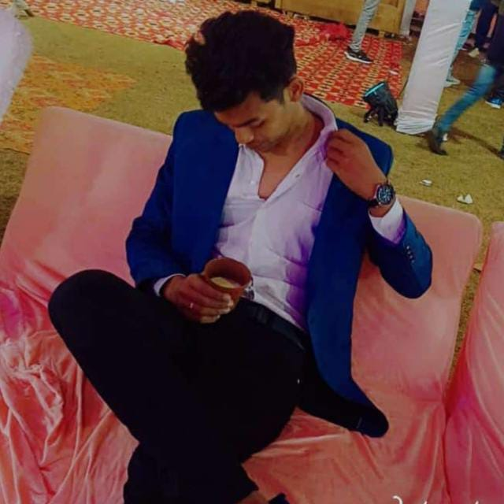

# Codesoft  My protofolio
<!DOCTYPE html>
<html lang="en">
<head>
    <meta charset="UTF-8">
    <meta name="viewport" content="width=device-width, initial-scale=1.0">
    <title>Document</title>
    <link rel="stylesheet" href="styles.css">
    
   
</head>
<body>
  

    <header>

      <nav>
    
        

            <a class="humberger" href="https://static.vecteezy.com/system/resources/previews/005/076/592/original/hacker-mascot-for-sports-and-esports-logo-free-vector.jpg">
            __</a>

            <ul class="ulnav">
              <li class="linav"><a class="limenu" href="#about"> About</a>  
          
</li>
          <li class="linav"><a class="limenu limenu2" href="#project1"> project</a>  
            
            
</li>
            
</li>
            <li class="linav"><a class="limenu limenu3" href="#skills"> Skills </a>  
          <li class="linav"><a class="limenu limenu3" href="#footer"> Contact </a>  
            
</li>
         
      </ul>

      </nav>
    </header>
        <header id="home">
            

            
       
         
      
            

            

            

              <h1 style="color: rgb(14, 242, 249);" > Hi,  Welcome  To My Portfolio &nbsp;&nbsp;&nbsp;&nbsp;&nbsp;&nbsp;&nbsp; 
                 
                &nbsp;&nbsp;&nbsp;&nbsp;&nbsp;&nbsp;&nbsp;&nbsp;&nbsp; I'm Divyanshu Pandey</h1>
           
                 <section id="about">

                 
               
                  

                    I am an enthusiastic learner,  and an exceptional listener. 
                   I have keen    interest in Web  Development and Practice Problem  Solving Skills regularly.  
                    I am an active participant in extracurricular as  well as volunteering activities, 
                    possess good communication skills. I strive hard to achieve the set targets by 
                  putting  in the best smart efforts and that is something which makes me different from others.
                  
 
                

              

      
             </section>    
                </header>   
           <section id="rsume">
               
            
 <b> Download  my resume</b> <a href="cvv!.pdf" download target="_blank">here</a>

           
           </section>
           <header>
         
              <section id="project1">
              

                
                 <h1>Projects 1</h1>
                
                     <h2>Analog Clock</h2>
              

              
                    

                       
                        

                            Analog Clock using HTML, CSS, and  JavaScript. It involves  manipulating the DOM  (Document Object Model) using JavaScript to updatet he clock's  hands   based on the current time.
                        

                        <a class="github-link" href="https://github.com/pandey155/Clock.git">GitHub Repository</a>
                        
                    

                  
                

                  
                  <h1>Project 2</h1>
                  
                     <h2>Gaana.com Clone</h>
                

                  
                </section>
              <section id="project1">

              

            
              

                Creating a Gaana Clone providing free and unlimited access to licensed music Using HTML,  CSS & JavaScript
              

              <a class="github-link" href="https://github.com/pandey155/gaana.com.git">GitHub Repository</a>
              
            

             

               
              <h1>Project 3</h1>
               
              <h2>Voice Controlled Home Automation</h2>
             

  

    <section id="project1">
       
        

         
      
      

        Project is based on IoT (Internet of Things).
In our project, we can control electrical appliances like TV, AC, fan with our phone. 
We give voice commands with the help of Bluetooth Module to the Arduino to perform the task.
     

      <a class="github-link" href="#">  GitHub Repository</a>  
      

              </section>    
                

         </section>
         

         
              

       
 
        
    
    

    
    </section>
     
      
    
    

        </form>
    </section>
    <section id="skills">
      <h2 class="section-title"> </h2>
    
      

        

          
          <h3>HTML5</h3>
          
Proficient in creating structured and semantically meaningful web content.

        

        

          
          <h3>CSS3</h3>
          
Skilled in designing visually appealing and responsive user interfaces.

        

        
        

          
          <h3>JavaScript</h3>
          
Experienced in developing interactive and dynamic web applications.

        

        
        

          
          <h3>Node.js</h3>
          
Skilled in server-side scripting and building scalable web applications with Node.js.

        

        
        

          
          <h3>MySQL</h3>
          
Experienced in designing and managing relational databases using MySQL.

        

        
        

          
          <h3>C#</h3>
          
Proficient in developing applications using the C# programming language.

        

      

    </section>
    
   
    <section id="resume"> 
       <h1>Resume</h1>
       
Download my resume <a href="cvv!.pdf" download target="_blank">here</a>.
 
    </section> 
  </section>
  
  

     
      
    <h2 class="h2footer">
      I'm always interested in hearing about new
        projects, so if you'd like
      to chat   please get in touch

    </h2>
   
    
    
    <form class="input"  action="https://formspree.io/f/mzbokrpo"></form>
    <method="POST">
    

    <input type="text" id="name2" class="none" placeholder="First Name" maxlength="30" required> 
    

    <input type="text"  id="lastname" class="none" placeholder="Last name" maxlength="30" required>
  

    <input type="email"  id="Email" class="none" placeholder="Email address" required>
    
 
    <textarea class="none" name="textarea" id="textarea1" cols="30" rows="10" placeholder="Hello . Glad to see you |" required></textarea>
  
     
     <button type="submit" class="lastbtn none">Get in touch</button>   
     
   
</body>

</html>

///////css code/////

body {
 
   
    background-color: #010101;
    background-repeat: no-repeat;
    background-position: right 80mm;
   
    display: flex;
    flex-direction: column;
    align-items: flex-start;
    padding: 125px 24px;
    position: relative;
  
  
    
}

  header {
    background-color: #0b0a0a;
    color: #090808;
    font-size: large;
    text-align: center;
    padding: 1rem 0;
    background-color: #020101;
   
    
    
  }
  header:hover {
    transform: translateY(-5px);
    box-shadow: 0px 4px 6px rgba(0, 0, 0, 0.2);
  }
  header h1 {
    font-size: 2.5rem;
    color: rgb(1, 1, 1);
    margin-bottom: 20px;
   
  }
  
  header p {
    font-size: 1.5rem;
    margin: 0;
    color: black;
  
    
  }

  #about {
    padding: 2rem;
  border: bottom 2px solid black; 
  background-color: #020101;
 
  }
 
  
  #about img {
    border-radius: 50%;
    max-width: 280px;
    display: block;
    margin: 0 auto;
    padding: 23px ;
    margin-bottom: 10px;
    
  }
  
  #about p {
    text-align: center;
    color: rgb(253, 251, 250);
   display: inline-block;
    font-family: "arial";
    font-size: 28px;
    
  }
  .container{
    font-family: "arial";
    font-size: 24px;
   
   
  }
  .typed {
    overflow: hidden;
    white-space: nowrap;
    width: 0;
    animation: typing;
    animation-duration:  2.2s;
    animation-timing-function: steps(30, end);
    animation-fill-mode: forwards;
  
  }
    
  @keyframes typing {
    from { width: 0 }
    to { width: 100% }
  
  }
  
 
  
  /* Reset some default styles */
body, h1, h2, p, ul, li, a {
    margin: 0px;
    padding: 0px;
    
   
  
  }
  
  /* Global styles */
  body {
    font-family: Arial, sans-serif;
 
    
  }
  
  /* Header styles */
  header {
    background-color: rgba(2, 2, 1, 0.728);
    color: #f00303;
    padding: 10px 0;
    background-color: #020101;
  
   
   
   
  }
  
  nav {
    display: flex;
    align-items: center;
    justify-content: space-between;
    padding: 0 20px;
    transform: translateY(-5px);
    box-shadow: 0px 4px 6px rgba(0, 0, 0, 0.2);
    background-color: #f90909;
   
  }
  .nav:hover{
    transform: translateY(-5px);
    box-shadow: 0px 4px 6px rgba(0, 0, 0, 0.2);
  }
 
  
  .img {
    font-size: 24px;
   
   
  }
  
  .humberger {
    text-decoration: none;
    color: #f6f3f3;
  

  }
  
  .a {
    font-size: 24px;
    color: white;
   
  }
  
  .aa {
    text-decoration: none;
    color: #f6f1f1;
  
    
  }
  
  .ulnav {
    list-style: none;
    display: flex;
   
   
  }
  
  .linav {
    margin-right: 20px;
    position: relative;
 
   
    
  }
  
  .limenu {
    text-decoration: none;
    color: #f5ebeb;
    display: inline-block;
    margin: 0 0px;
    padding: 5px 10px;
    border: 2px solid #f9f7f7;
    border-radius: 15px;
    color: rgb(250, 246, 246);
    font-size: 1.2rem;
    text-align: center;
    background-color: #080808;
    
  }
  
  .hrmenu {
    border: 1px solid #fff;
    position: absolute;
    bottom: -10px;
    width: 100%;
  }
  
  .none2 {
    display: none;
  }
  
  /* Reset some default styles */
body, h1, h2, p, ul, li, button {
    margin: 1px;
    padding: 10;
    text-align: center;
  }
  
  /* Global styles */
  body {
    font-family: Arial, sans-serif;
  }
  
  /* Project container styles */
  .project {
    display: flex;
    align-items: center;
    justify-content: center;
    height: 400px;
    background-color: #f0f0f0;
    margin: 0px 0px;
    
  }
  
  .none2 {
    display: none;
  }
  
  /* Button styles */
  .btn1 {
    padding: 10px 20px;
    background-color: #ca1111;
    color: #fff;
    border: none;
    border-radius: 5px;
    cursor: pointer;
    text-align: center;
  }
  
  /* Project details styles */
  .project2 {
    display: none;
    padding: 20px;
    border: 1px solid #ccc;
    background-color: #fff;
    text-align: center;
    animation-play-state: running;
  }
  .project2:hover {
    transform: translateY(-5px);
    box-shadow: 0px 4px 6px rgba(0, 0, 0, 0.2);
  }
  
  .s4h1 {
    font-size: 24px;
    margin-bottom: 10px;
    text-align: center;
  }
  
  .p2 {
    font-size: 16px;
    margin-bottom: 20px;
    text-align: center;
  }
  
  .lan2 {
    list-style: none;
    display: flex;
    
  }
  
  .lan2 li {
    margin-right: 10px;

  }
  
  .lan2 li img {
    width: 30px;
    height: 20px;
 
  }
  .logo {
    text-align: center;
  }
  
  .logo img {
    max-width: 150px;
    height: auto;
  }
  /* Project section styles */
#projects {
    padding: 20px;
    background-color: white;
  
  }
  .project:hover {
    transform: translateY(-5px);
    box-shadow: 0px 4px 6px rgba(0, 0, 0, 0.2);
  }
  
  .project {
    border: 1px solid #ccc;
    padding: 20px;
    margin-bottom: 20px;
    background-color: #c2c20c;
    background-image: url(https://png.pngtree.com/background/20220729/original/pngtree-abstract-elegant-white-and-gray-background-with-diagonal-stripes-lines-picture-image_1865305.jpg);
   
    border-top:3px solid rgb(10, 10, 10);
    border-bottom: 3px solid black;
    opacity:10;
    transform: translateY(20px);
    transition: opacity 0.5s ease, transform 0.5s ease;
  }
  
  .project.fade-in {
    opacity: 1;
    transform: translateY(0);
  }
   
  
  
  .project h3 {
    font-size: 24px;
    margin-bottom: 10px;
    text-align: top;
   
    
  }
  
  .project p {
    font-size: 26px;
    margin-bottom: 15px;
    color: rgb(13, 10, 10);
  
   
  }
  
  
  .github-link {
    display: inline-block;
    padding: 5px 10px;
    background-color: #000000;
    color: #b4f907;
    text-decoration: none;
    border-radius: 5px;
  }
  
  .github-link:hover {
    background-color: #555;
  }
  
  .project img {
    max-width: 430px;
    height: auto;
  }
  
  .btn1 h3{
    color: #f7f1f1;
  }
  /* Global styles */
body {
  font-family: Arial, sans-serif;
}

/* Skills section */
#skills {
padding: 50px 8em;
  text-align: center;
  margin: auto;
  background-color: #020101;
}

.section-title {
  font-size: 34px;
  margin-bottom: 40px;
  
}

.skills-grid {
  display: flex;
  grid-template-columns: repeat( auto-fit minmax(200px, 1fr));
  gap: 15px;
  justify-content: center;
}

.skill {
  background-color: #ed0524;
  border: 1px solid #020101;
  border-radius: 4px;
  padding: 20px;
  box-shadow: 0px 2px 4px rgba(230, 227, 227, 0.1);
  transition: transform 0.3s, box-shadow 0.3s;
 
}

.skill:hover {
  transform: translateY(-5px);
  box-shadow: 0px 4px 6px rgba(0, 0, 0, 0.2);
}

.skill img {
  max-width: 0px;
  height: auto;
  margin-bottom: 0px;
}

.skill h3 {
  font-size: 20px;
  margin: 10px 0;
  color: black;
}

.skill p {
  font-size: 18px;
  color: white;
}

/* Responsive adjustments */
@media screen and (max-width: 768px) {
  .skills-grid {
    grid-template-columns: repeat(auto-fit, minmax(150px, 1fr));
  }
}

#resume {
   padding: 2rem; text-align: center; 
  width: 1378px; 
  font-size: 1.6rem; 
   border-top:0.001px solid rgb(251, 245, 245); 
   border-bottom: 0.001px solid rgb(251, 247, 247);
    background-color: #f9f5f5;
    color: rgb(5, 4, 4);
margin-top: 40px; } 
#resume img{ 
  text-align: center;
 }
 #resume p { text-align:center; 
  font-size: 2.2rem;
 
 } 
 #resume a { 
  color: #f40a0a;
   text-decoration: none;
    font-weight: bold;
   }
   #footer {
    background-color: #060606;
    width: 100%; /* Adjust this according to your layout */
    padding: 80px 0; /* Adjust padding according to your design */
    border-top: 4px solid black;
    display: flex;
    justify-content: center; /* Center content horizontally */
    align-items: center; /* Center content vertically */
  }
  
  #footer:hover {
    transform: translateY(-5px);
    box-shadow: 0px 4px 6px rgba(0, 0, 0, 0.2);
  }
  
  
  .h2footer{
    position: static;
    font-weight: 700;
  margin-bottom: 430px;
  margin-right: 230px;
    font-size: 37px;
    line-height: 44px;
    text-align: center;
    color: #fef9f9;
    
    
  }
  
  input {
    height: 28px;
    left:46px;
    right: 46px;
     
    top: calc(50% - 8px / 2);
    font-family: "Inter", sans-serif;
    font-style: normal;
    font-weight: 400;
    font-size: 20px;
    line-height: 4px;
    display: flex;
    padding-right: 23px;
    border: none;
    color: #e15b26;
    width: 415px;
 
    
  }
  
  input,
textarea {
  /* Common styles */
  width: 100%; 
  margin-bottom: 20px; /* Space between elements */
  padding: 0px; /* Adjust as needed */
  border: 1px solid #ccc; /* Add a subtle border */
  border-radius: 4px; /* Rounded corners */
  font-family: "Inter", sans-serif;
  font-size: 16px;
  color: #333;
}

textarea {
  height: 120px; /* Adjust as needed */
}
  .lastbtn {
    height: 48px;
    width: 131px;
    left: 98px;
    top: 282px;
    padding: 10px;
    background-color: #ec9e02;
    border: none;
    font-family: "Inter", sans-serif;
    font-size: 17px;
    font-weight: 700;
    line-height: 24px;
    letter-spacing: 0.03em;
    text-align: center;
    margin-left: 9px;
    margin-top: 24px;
    color: #080808;
  }
  
  #email {
    margin-top: 39px;
  }
  
  .hrbtn {
    margin-top: 124px;
    width: 375px;
    margin-left: -20px;
  }
  
  .hrtext {
    width: 327px;
    margin-left:0;
  }
  #contact {
    padding: 2rem;
    text-align: center;
    border: 2px solid rgb(244, 239, 239);
    
    background-color: #ed0909;
    
  
  }
  
  #contact p {
    text-align: left;
  }
  
  #contact {
    padding: 2rem;
    text-align: center;
    border: 0.1px solid rgb(211, 161, 161);
    
    background-color: #f5ecec;
  
  }
  
  #contact p {
    text-align: center;
  }
  
.as{
  border: 1px solid black;
  background-color: #030303fc;
}
  #project1{
    background-color: rgba(246, 244, 243, 0.794);
  }

.contact-info {
  margin-top: 20px;
  padding: 15px;
  border-radius: 15px;
  text-align: left;

 
}

/* Style for the contact information heading */
.contact-info h3 {
  font-size: 1.2rem;
  text-align: left;
  
}

/* Style for individual contact details */
.contact-info p {
 text-align: left;
  font-size: 1rem;
  color: #100f0f;
  margin-top: auto;

}

/* Style for the website link */
.contact-info p a {
  color: #007bff;
}
#rsume{
 
 margin-left: 530px;
 padding-left: 520px;
 font-size: 2.0rem;
 
 
  
}

@keyframes blink {
  0% { opacity: 1; }
  50% { opacity: 0; }
  100% { opacity: 1; }
}

/* Style for the blinking text */
#rsume p {
  text-align: center;
  animation: blink 1s infinite; /* Apply the blink animation */
  color: rgb(241, 5, 5);
 
}
/* Styling for the <section> element */
.ass {
  margin: 20px;
  padding: 10px;
  justify-content: space-between;
  display: flex;
  background-color: #f80404;
 
}

/* Styling for the <ul> element */
.ass ul {
  list-style-type: none;
  padding: 0;
  display: flex;
 
 
}

/* Styling for the <li> elements */
.ass li {
  margin: 0 0px;
  padding: 5px 10px;
 
}

/* Styling for the <a> elements */
.ass a {
  text-decoration: none;
  color: #feffff;
 
}

/* Styling for <a> elements on hover */
.ass a:hover {
  text-decoration: underline;
}
.typed h1{
  text-align: start;
  color: white;
}
.xcc img{
  border-radius: 50%;
    max-width: 280px;
    display: block;
    margin: 0 auto;
    padding: 23px ;
    margin-bottom: 10px;
}
body {
  font-family: Arial, sans-serif;
}
footer {
  text-align: center;
  padding: 20px;
  background-color: #f2f2f2;
}

#ad img {
  border-radius: 50%;
  max-width: 100%;
  margin: 10 auto;
  display: block;
  padding: 10px; 
}

////// javascript code/////////

 // Smooth scrolling to section when clicking on navigation links
  document.querySelectorAll('a[href^="#"]').forEach(anchor => {
    anchor.addEventListener('click', function (e) {
      e.preventDefault();
      document.querySelector(this.getAttribute('href')).scrollIntoView({
        behavior: 'smooth'
      });
    });
  });

  // Toggle mobile menu
  const mobileMenuButton = document.querySelector('#mobile-menu-button');
  const mobileMenu = document.querySelector('#mobile-menu');

  mobileMenuButton.addEventListener('click', () => {
    mobileMenu.classList.toggle('show');
  });

  // Show/hide contact form
  const contactButton = document.querySelector('#contact-button');
  const contactForm = document.querySelector('#contact-form');

  contactButton.addEventListener('click', () => {
    contactForm.classList.toggle('show');
  });

  // Display current year in footer
  const currentYear = new Date().getFullYear();
  document.querySelector('#current-year').textContent = currentYear;
  // JavaScript for Toggle Menu
const menuToggle = document.querySelector('.menu-toggle');
const nav = document.querySelector('.nav');

menuToggle.addEventListener('click', () => {
    nav.classList.toggle('active');
});
function changeLanguage(language) {
  var element = document.getElementById("url");
  element.value = language;
  element.innerHTML = language;
}

function showDropdown() {
  document.getElementById("myDropdown").classList.toggle("show");
}

// Close the dropdown if the user clicks outside of it
window.onclick = function(event) {
  if (!event.target.matches('.dropbtn')) {
      var dropdowns = document.getElementsByClassName("dropdown-content");
      var i;
      for (i = 0; i < dropdowns.length; i++) {
          var openDropdown = dropdowns[i];
          if (openDropdown.classList.contains('show')) {
              openDropdown.classList.remove('show');
          }
      }
  }
}
function handleScroll() {
  const projects = document.querySelectorAll('.project');
  projects.forEach(project => {
    const projectTop = project.getBoundingClientRect().top;
    const windowHeight = window.innerHeight;
    if (projectTop < windowHeight * 0.8) {
      project.classList.add('fade-in');
    }
  });
}

window.addEventListener('scroll', handleScroll);
// Trigger the handleScroll function on page load
handleScroll();

